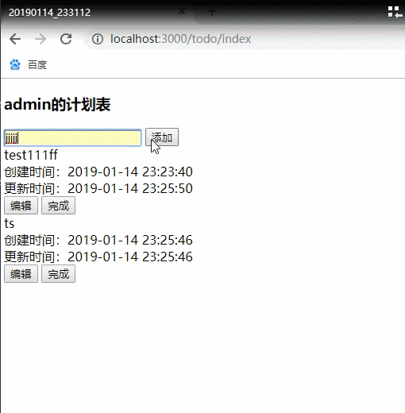
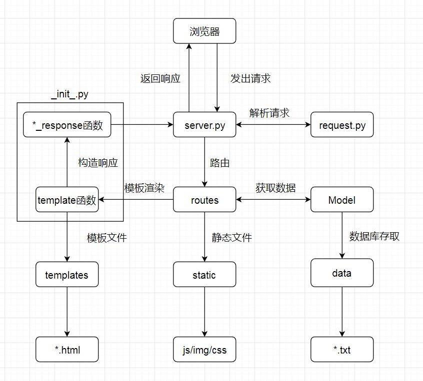

# Simple mini web
**简介**

- 一个简单迷你的web项目，不使用现有轮子，旨在熟悉并掌握web开发的各个方面

**功能实现**

- 通过Request类实现对http请求的解析和复用
- 通过template函数实现基础的模板替换
- 通过服务器端session保存会话状态
- 通过txt文件实现基础数据存取
- 通过字典路由表实现请求分发
- 通过多进程实现并发响应
- 通过Ajax实现前后端分离

**效果**

**流程图**

**部署**

安装python3.6，先运行reset.py，再运行server.py